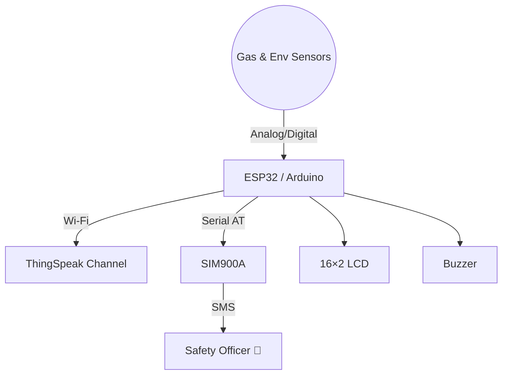

# IoT Based Sewage Gas Monitoring System And Netralization Process

> **Smarter Sewage, Safer Cities.**\
> An open‑source IoT platform that detects toxic gases and rising water levels in real‑time, protecting underground workers and urban infrastructure.

&#x20;&#x20;


---

## 📜 Table of Contents 

1. [Why this Project?](#why-this-project)
2. [Key Features](#key-features)
3. [System Overview](#system-overview)
4. [Hardware Bill of Materials](#hardware)
5. [Quick Start](#quick-start)
6. [ThingSpeak Dashboard](#cloud-dashboard)
7. [Alert Rules & Thresholds](#alert-rules--thresholds)
8. [Roadmap](#roadmap)
9. [Contributing](#contributing)
10. [License](#license)

---

## Why this Project?

Underground sewage networks are harsh, confined environments where toxic gases build up and water levels change rapidly. Traditional periodic inspections leave workers exposed to invisible dangers.

`Smart Sewage Sentinel` offers always‑on monitoring, instant SMS alerts, and a live cloud dashboard—turning an invisible threat into actionable data.

---

## Key Features

- **Multi‑Gas Detection** — CO₂, CH₄, H₂S, NH₃ monitored every few seconds.
- **Overflow Guard** — Ultrasonic sensor detects rising water before it floods.
- **Dual Alerting** — Loud local buzzer *and* SMS via GSM for remote teams.
- **Plug‑and‑Play Cloud** — Auto‑publishes to ThingSpeak for graphs & history.
- **On‑Site LCD** — 16×2 display scrolls live readings and status.
- **Runs on ESP32 or Arduino** — Choose Wi‑Fi or GSM‑only connectivity.

---

## System Overview



---

## Hardware

| Qty | Component                           | Part No. / Example                        |
| --- | ----------------------------------- | ----------------------------------------- |
| 1   | **ESP32 DevKit‑C** (or Arduino Uno) | DOIT ESP32 DEVKIT V1                      |
| 1   | **CO₂ Sensor**                      | MG‑811                                    |
| 1   | **CH₄ Sensor**                      | MQ‑4                                      |
| 1   | **H₂S Sensor**                      | MQ‑136                                    |
| 1   | **NH₃ Sensor**                      | MQ‑137                                    |
| 1   | **Temp/Humidity**                   | DHT22 (or DHT11)                          |
| 1   | **Ultrasonic**                      | HC‑SR04                                   |
| 1   | **GSM Module**                      | SIM900A                                   |
| 1   | **LCD 16×2**                        | w/ I²C adapter recommended                |
| 1   | **Buzzer**                          | Passive 5 V                               |
| —   | Misc                                | Breadboard, jumper wires, 5 V @2 A supply |

> **Tip:** A full Fritzing wiring diagram lives in `docs/wiring.fzz`.

---

## Quick Start

### 1⃣ Clone & Open

```bash
git clone https://github.com/your‑username/sewage‑sentinel.git
cd sewage‑sentinel/firmware
```

Open `or` sketch (choose one) in Arduino IDE.

### 2⃣ Install Libraries

```
LiquidCrystal  |  DHT sensor library
ThingSpeak     |  WiFi (ESP32 only)
```

Install via **IDE → Library Manager**.

### 3⃣ Configure

- **Wi‑Fi SSID / PASS** — for ESP32 (`secrets.h`).
- **ThingSpeak** — channel ID & write API key.
- **SMS Numbers** — replace default placeholders in `gsm.cpp`.

### 4⃣ Upload & Enjoy

Select the correct board & port → **Upload**.\
LCD should print *Project Ready*, and your ThingSpeak graphs will start drawing.

---

## Cloud Dashboard

Create a free ThingSpeak channel with these fields:

| Field | Data             |
| ----- | ---------------- |
| 1     | CO₂ (ppm)        |
| 2     | CH₄ (ppm)        |
| 3     | H₂S (ppm)        |
| 4     | NH₃ (ppm)        |
| 5     | Water Level (cm) |
| 6     | Temperature (°C) |
| 7     | Humidity (%)     |

> **Pro‑Tip:** Enable “Public View” to share live charts with city engineers.

---

## Alert Rules & Thresholds

| Gas         | Threshold        | Action       |
| ----------- | ---------------- | ------------ |
| CO₂         | > 300 ppm        | Buzzer + SMS |
| CH₄         | > 300 ppm        | Buzzer + SMS |
| H₂S         | > 500 ppm        | Buzzer + SMS |
| NH₃         | > 300 ppm        | Buzzer + SMS |
| Water Level | < 20 cm from top | Buzzer + SMS |

Thresholds live in `config.h` — tweak for your deployment.

---

## Roadmap

-

Have an idea? Open an issue or PR! 🚀

---

## Contributing

1. Fork 🎉
2. Create a feature branch
3. Commit & push with clear messages
4. Open a Pull Request — we love collaboration ❤

Please follow the **Conventional Commits** spec.

---

## License

`IoT Based Sewage Gas Monitoring System and Neutralization Process` is released under the **Creative Commons Zero v1.0 Universal** — see [`LICENSE`](LICENSE) for details.

---

## Author & Contact

Built with ✨ by **Sharansidh**.\
Questions, feedback or deployments? Reach me on [LinkedIn](https://www.linkedin.com/in/sharansidh0301/) or open an issue.

